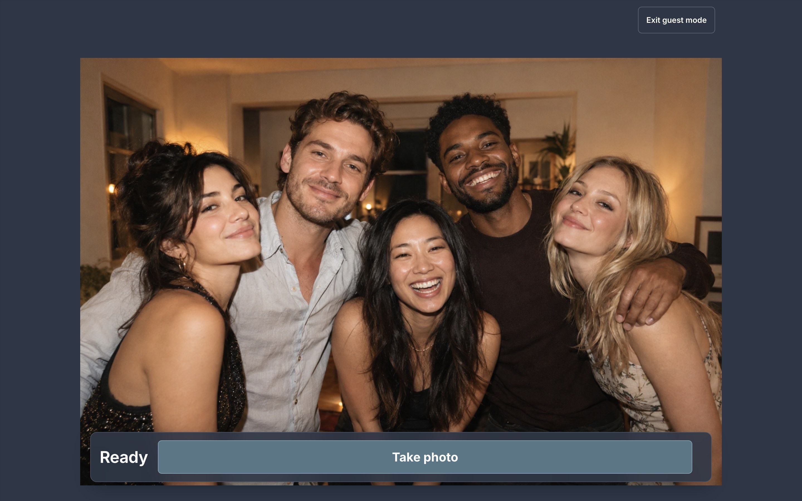
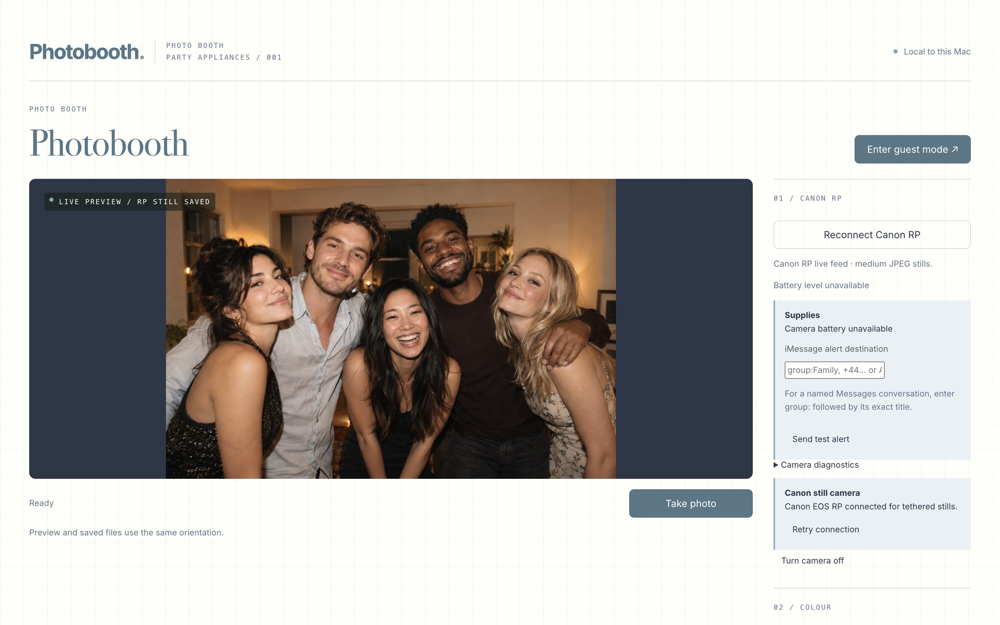
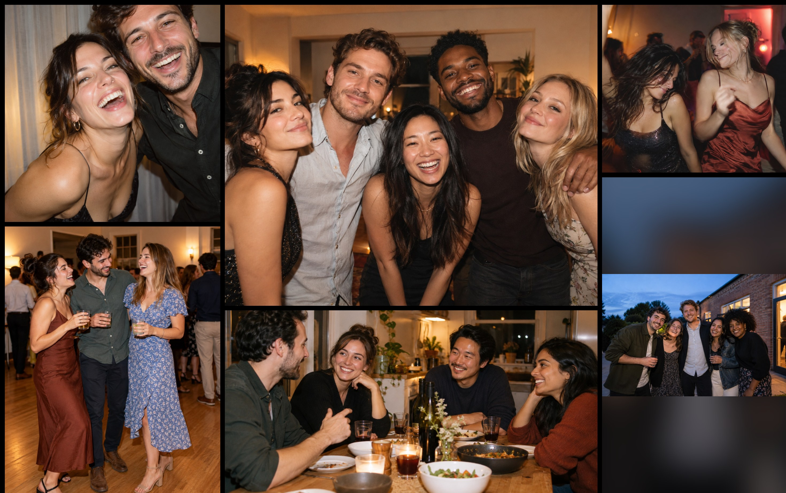

# Party Appliances

Two local-first Mac apps for making photographs and showing them at parties.
They work independently, or can pass new photographs from the booth into the
slideshow during an event.

## Photobooth

Photobooth controls an external camera over USB, shows guests a live preview,
takes the photograph and applies a chosen colour treatment. The tested setup
uses a Canon EOS RP through `gphoto2`, but the camera layer is designed to grow
to support other tethered cameras.

Every photograph is saved locally as an untouched original and a finished
JPEG. Optional additions can print a small version and QR code on an Epson
receipt printer, and upload the finished photograph to a public phone-friendly
gallery. The camera-only booth needs neither of those services nor an internet
connection.

<p>
  
  
</p>

## Loop

Loop is a projector slideshow for both photographs and videos. It can use one
large image or a changing grid of mixed aspect ratios, with tiles moving and
changing at staggered times. Long videos return as different short excerpts, so
video can remain part of the evening without stopping the whole slideshow for
several minutes. That mixed photo-and-video playback is the main reason Loop
exists instead of using a conventional photo slideshow.



## Using them together

Photobooth can upload photographs to its optional public gallery. Loop can poll
that gallery and weave new booth photographs into the running slideshow within
a few minutes. The integration is best-effort: both apps continue working
locally if the network disappears, and neither app requires the other.

## Try it

Party Appliances currently targets Apple-silicon Macs. Photobooth is tested
with the Canon EOS RP and Loop works with ordinary image and video files.

```sh
git clone https://github.com/rorydbain/party-appliances.git
cd party-appliances
./scripts/setup-macos.sh --booth-only  # Photobooth only
./scripts/setup-macos.sh --loop-only   # Loop only
./scripts/setup-macos.sh               # Both apps
```

The generated apps are development builds and are not yet notarised. See the
guides for the complete setup:

- [Photobooth](docs/PHOTOBOOTH.md)
- [Loop](docs/LOOP.md)
- [Tested hardware](docs/HARDWARE.md)
- [Optional gallery](docs/CLOUD.md)
- [Optional receipt printer](docs/PRINTER.md)
- [Development](docs/DEVELOPMENT.md)

This is an early public beta. Rehearse the complete hardware setup before using
it at an event. Party Appliances is available under the [MIT licence](LICENSE).
The screenshots contain fictional synthetic demo photographs rather than real
event guests.
