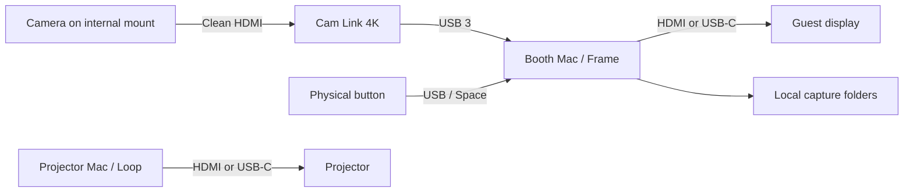

# A small studio in a cardboard shell

> **Updated brief:** photos are primary, films secondary, and the booth must travel by train as one contained unit. See the [portable portrait-box proposal](COMPACT-BOOTH.md), which supersedes the external-softbox shopping direction below. The existing app still uses video-frame capture; tethered stills and flash remain proposed work.

**Recommendation:** use your two Macs. Make Loop the projection appliance and Frame the booth appliance. The original video-feed proposal used a dedicated Sony ZV-E10 and 16–50mm lens; see the revised proposal for the current photo-first direction. Put a meaningful share of the budget into a large soft light, mounting and a clean background.

This is a £500–£1,000 project excluding the Macs and projector, with second-hand buying and later resale in mind. No equipment has been purchased. The prices below are either explicitly labelled asking prices checked on 6 September 2026 or shopping targets, not live eBay offers.

## The MVP we are building

| Appliance | Keep | Leave until the photographs look right |
|---|---|---|
| Loop, on the projector Mac | Chosen photos and videos; saved order; automatic repeat; separate clean output; pause/skip/blackout; playback check | Phone uploads, internet, guest content automatically appearing on the projector |
| Frame, on the booth Mac | Live framing; three-second countdown; RP full-resolution stills or ten-second film; optional sound; originals and Portra treatment; automatic local saving | Printers, QR delivery, games, account login |

The interface is warm off-white, charcoal and a small acid-green accent. Guest mode strips it back to camera, capture mode and one large button. There is no wedding copy, date stamp on images, pretend film border, confetti or branded overlay on the photographs. This is a neutral first edition. If we choose MSN, an iPod or Nintendo DS later, that becomes a researched, coherent reproduction of one specific interface, including its behaviour and sounds. A mix of nostalgic motifs would weaken it.

## Dedicated booth: a sensible used shopping list

My preferred candidate is the **original Sony ZV-E10 with the Sony E PZ 16–50mm OSS**, feeding a genuine **Elgato Cam Link 4K** over HDMI. The wider zoom is useful when the room is tight and the camera can remain installed in the booth. This is a candidate to bench-test, not a claim that this exact camera/capture/Mac combination has been tested here. Sony documents 4K HDMI output; check the exact body’s clean output, focus, power and heat behaviour in the return window. [Sony ZV-E10 specifications](https://www.sony.co.uk/electronics/support/e-mount-body-zv-e-series/zv-e10/specifications), [Sony help guide](https://helpguide.sony.net/ilc/2070/v1/en/print.pdf), [Elgato camera compatibility guidance](https://help.elgato.com/hc/en-us/articles/360028243051-Cam-Link-4K-Is-Your-Camera-Compatible).

| Part | Second-hand shopping target | What to look for |
|---|---:|---|
| Sony ZV-E10 + 16–50mm OSS lens | £440 | Original model, functional micro-HDMI socket, charger/battery, no sensor damage. A kit auction can beat separate body/lens pricing. |
| Genuine Elgato Cam Link 4K | £65 | Older 4K30 version is enough; a listing that accepts 4K but captures only 1080p is not equivalent. |
| amaran 60x S light | £120 | Includes the correct mains supply and functioning fan; Bowens mount intact. |
| 60cm Bowens softbox + diffusion | £40 | Both diffusion layers, appropriate speed ring; grid welcome. |
| Light stand + weight | £35 | Supports the fixture and softbox safely. |
| Used 15–22-inch HDMI display | £55 | A normal 1080p display is enough; test visibility and mounts. Touch is optional. |
| Camera continuous power | £45 | Correct, reputable supply for the chosen body; verify it runs the whole session. |
| Micro-HDMI lead, USB 3 adapter, mains distribution | £30 | Short camera lead and strain relief. USB 3 data, not a charging-only adapter. |
| Internal frame, cardboard, matte lining, reflector | £35 | Existing scrap material can help. |
| USB button or small keyboard | £15 | A button that sends a Space keystroke; keep a host keyboard accessible. |
| **Target total** | **£980** | Includes a display; assumes patient used buying. |

These individual used targets are estimates, not verified available deals. As a current retail-used reference, MPB listed ZV-E10 bodies from **£414–£449**, with 16–50mm lenses from **£29–£93**. New Cam Link 4K was **£99.99** at Elgato when checked. That makes the £440 camera-and-lens target worth looking for on eBay, but not guaranteed. If the basket exceeds £1,000, use the Mac’s own screen behind a cut-out and omit the separate display before compromising the light or buying an unknown capture adapter. [MPB ZV-E10 listings](https://www.mpb.com/en-uk/product/sony-zv-e10), [Elgato Cam Link 4K](https://www.elgato.com/uk/en/p/cam-link-4k).

A cheaper and simpler alternative is an **Elgato Facecam 4K** plus the same lighting. Elgato’s current UK price was **£179.99**, and it supports manual controls through Camera Hub on Mac. It has no built-in microphone. I would choose it for convenience; I would favour the used Sony route for the lens choice and larger-sensor portrait potential you care about. Neither camera has been image-quality tested in your room. [Facecam 4K](https://www.elgato.com/uk/en/p/facecam-4k).

The amaran 60x S is a 65W bi-colour fixture with a Bowens mount, high published colour-rendering scores and active cooling. Continuous light works for both still frames and films. The 60cm modifier creates the broad source; a tiny diffuser placed directly on a small LED is not an equivalent portrait light. The complete modifier, distance and angle matter more than the CRI number alone. [amaran technical specifications](https://help.amarancreators.com/en/amaran-60xs/photometrics-technical-specifications), [amaran product manual](https://docs.aputure.com/hubfs/Knowledge%20Base/amaran/amaran%2060x%20S/All%20files/amaran-60x-S-Product-Manual-V1.0.pdf).

## How the box becomes a booth

Assumption: the box encloses the equipment; guests stand in front of it. An occupied walk-in cardboard enclosure would need a different, larger construction plan. Use a stool if you want consistent eye height and a more intimate one- or two-person portrait. Leave an accessible clear approach and a framing option for seated guests.

Start around **55cm wide × 45cm deep × 75cm high**, on a stable support. These are layout targets, not a cut list: measure the actual display, open Mac and camera first. A laptop with its lid open needs more depth and ventilation than a Mac mini. Do not buy a screen based on those example dimensions alone.

- A timber/plywood frame or stable shelving unit takes all the loads. The cardboard gives it a clean exterior. Attach the screen and camera to the inner structure, with a weighted base.
- The lens looks through a small opening near eye height, immediately above the display. Minimise the distance between the lens and the on-screen face so people do not appear to look down.
- Use matte black material around the lens opening to avoid flare and internal reflections. Keep the front mostly blank. A simple “Photo / Film” instruction is enough.
- Put the computer on its own ventilated shelf. Provide large rear/side openings and a removable host access panel; keep power supplies and cables accessible.
- Mount the softbox on its own stand above and to camera-left, outside the cardboard. It can read visually as part of the installation without placing a hot fixture inside a combustible box. Keep fixture ventilation and manufacturer clearances unobstructed; the cardboard must not support the lamp or touch the fixture.
- Route cables down the inner frame, clamp the delicate micro-HDMI lead, secure floor runs and weight the stand. Leave access to the power switch.

The two Macs run independently. Booth footage does not enter the projection playlist automatically. After the party, copy the booth folder to the other Mac if desired.

## The lighting recipe

For the first test, aim for an editorial portrait: soft directional light, natural skin, a calm dark background and no novelty overlay.

1. Put the guest mark **1.2–1.8m from the lens**, then adjust the zoom for the real group size. Start around 20–24mm on the Sony APS-C zoom if the space allows; widen towards 16mm only when needed. Keep faces away from the extreme edges.
2. Place the **60cm softbox roughly 0.7–1m from the subject**, 30–45° to camera-left, with its centre a little above eye level. Point it down towards faces. These are starting positions to adjust by looking at actual photographs.
3. Put a white foam-board reflector on the opposite side. Move it closer to soften shadows; further away for more shape. This gives a second useful surface without another powered light.
4. Separate the subject from the backdrop by approximately **0.8–1.2m** where possible. A plain charcoal, muted olive or deep blue background is easier to light well than a shiny decorative wall.
5. Set the key around **5000K**, then set and lock the camera’s white balance using a neutral card under that light. Keep coloured party lighting off the face. Turn off automatic white balance once the look is right.
6. For the Sony, start with **4K25, 1/100s, f/4–f/5.6**, raising the light output before raising ISO. This is my proposed compromise for sharper still frames and acceptable motion; it is crisper than conventional 1/50s film motion. In a 50Hz UK venue, check the actual lamps for bands at your selected shutter speed. Use 1/50s for smoother movement if the photos remain sharp enough.
7. Lock exposure and choose either face AF that you have tested under this light or fixed focus on a well-marked standing position. Turn beauty/skin smoothing and log/HDR modes off for the first pass. Start with a standard, natural camera profile. Do not send an ungraded log feed into the app.
8. Photograph several real people, including different skin tones, glasses, light/dark clothing, and two people at different depths. Inspect faces at full size. Adjust light position and exposure before touching software treatment.

For the Fuji trial, experiment with a film simulation in-camera and Frame’s **Camera colour** setting. For the Sony, start from its normal colour output. The MVP’s “Soft colour” and monochrome choices are intentionally simple image treatments; they are not bespoke film-emulation LUTs or colour calibration. Keep the original frame so we can grade it later. A custom look should be built from your actual camera and lighting samples.

## Where the EP-2350 fits

The EP-2350 FX-MIC is a promising optional object for the film mode: a physical microphone with effects gives guests something to do naturally. Teenage Engineering describes it as deliberately lo-fi and specifies a **3.5mm stereo line output**. USB-C is used for power and file/firmware work; the documented recording connection is analogue. [Official product](https://teenage.engineering/store/ep-2350), [official manual](https://teenage.engineering/guides/ep-2350).

Connect it to a class-compliant USB audio interface with suitable line inputs, using the correct stereo breakout cable; select that interface as Frame’s microphone and enable film sound. Do not treat a stereo output as a balanced mono signal, and do not connect a line output to a bare high-gain mic input without suitable attenuation. This connection plan is an engineering recommendation; choose the interface and cable together after checking the exact unit. Keep speaker monitoring off inside the booth to avoid feedback. The app’s film review is silent, but any recorded sound stays in the file.

It adds another purchase, gain staging and audio sync to test. I would make silent films work first, then decide whether the microphone is the one extra playful feature. No receipt printer or microphone integration was simulated in the MVP.

## Why not Raspberry Pi first?

A Pi is possible, but it would add a new operating system, camera/driver choices and performance testing while you already have the two Macs. This first build is a Mac Electron application, not a supported Pi image. A Pi camera and libcamera pipeline could be a separate version later. Reusing a Mac gives us a known display, keyboard, storage and a straightforward HDMI/USB capture route now.

## The quality ceiling, and the next worthwhile upgrade

Frame captures the live feed. **4K = 3840×2160 = 8.3 megapixels**, which can be enough for attractive small prints and sharing with the right optics and light. It does not use the camera’s still shutter, full-resolution sensor files, flash synchronisation or RAW workflow. Motion blur, video compression and camera processing still affect the saved frame.

If the lit 4K test is beautiful, stop there. If you want large print quality or flash-frozen stills, the next feature should be genuine tethered capture for one chosen camera, keeping the video preview and guest flow. That requires a proven camera-specific control path and tests for transferring full-resolution files; it should not be represented as already built.

Only after that decision: consider one distinctive extra. A thermal receipt printer would suit deliberately dithered monochrome souvenirs, but it is not a high-quality photo printer and thermal prints are not archival. Phone delivery introduces a network, storage policy and sharing flow. Both are deliberately outside this MVP.
